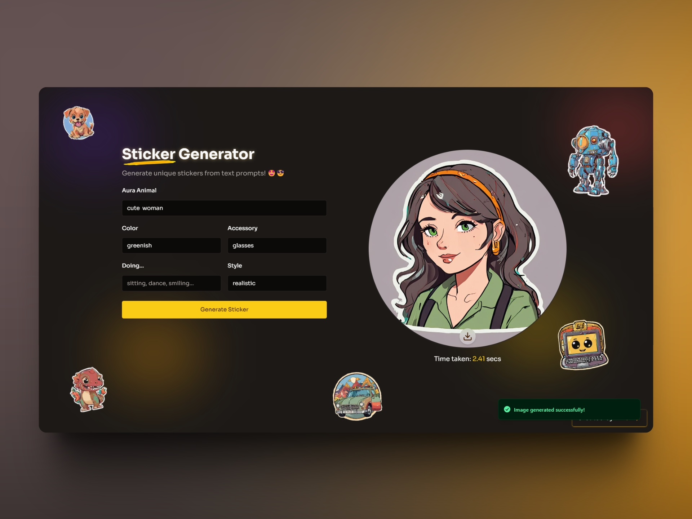

# Project Name: AI sticker Generator

## Features

- Easy-to-use interface for designing stickers
- Customizable styles, colors, and text options
- Ability to export stickers in image format

## Installation

1. Clone the repository: `git clone https://github.com/Xeven777/sticker-gen.git`
2. Navigate to the project directory: `cd sticker-gen`
3. Install dependencies: `npm install`

## Usage

1. Run the application: `npm start`
2. Open your web browser and go to `http://localhost:3000`
3. Design your sticker using the provided tools and options
4. Export the sticker in your desired format
5. Use the generated sticker in your project documentation, README files, or any other relevant places

## Contributing

Contributions are welcome! If you have any ideas, suggestions, or bug reports, please open an issue or submit a pull request.

Made By Me ([Anish](https://bento.me/anish7)) .
